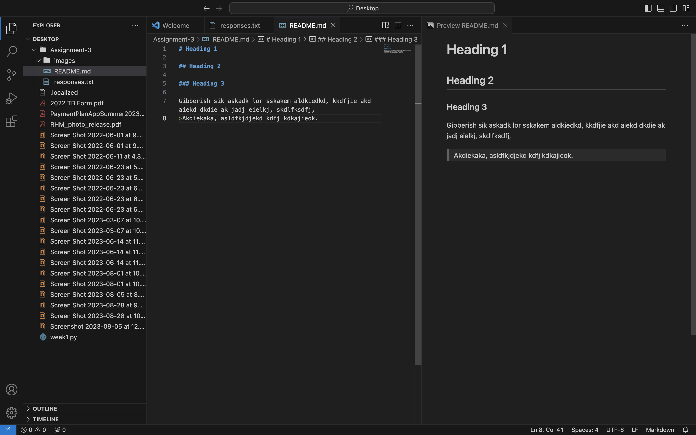

# Heading 1

## Heading 2

### Heading 3

Gibberish sik askadk lor sskakem aldkiedkd, kkdfjie akd aiekd dkdie ak jadj eielkj, skdlfksdfj, 
>Akdiekaka, asldfkjdjekd kdfj kdkajieok.
>

[Interesting website!](http://info.cern.ch/)
